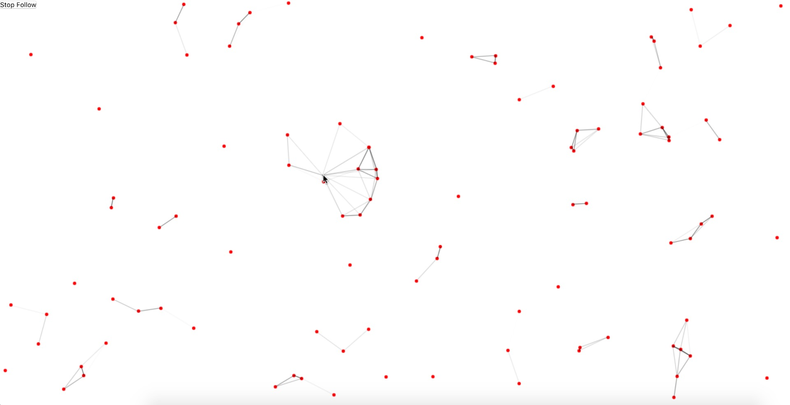

# React-Canvas-Nest
[](https://www.npmjs.com/package/react-canvas-nest) [](https://github.com/flyerH/react-canvas-nest/blob/master/LICENSE) [](https://bundlephobia.com/result?p=react-canvas-nest)

English | [简体中文](./README-zh.md)
>  React component for a nest backgroud.

Creativity is inspired by [canvas-nest.js](https://github.com/hustcc/canvas-nest.js)  



## Install
```bash
# use yarn
yarn add react-canvas-nest

# or use npm
npm install react-canvas-nest
```

## Usage

**Note:**
- You can refer to this [example](./example).
- Component size depends on parent node size.

Import Component
```js
import ReactCanvasNest from 'react-canvas-nest';
```
Use Component
  - Default
  ```jsx
  <ReactCanvasNest />
  ```
  - Custom 
  ```jsx
  <ReactCanvasNest className = 'canvasNest' config = {{ pointColor: ' 255, 255, 255 ' }} style = {{ zIndex: 99 }} />
  ```
  
## API
### className
    Support className attribute

### config
| Property     | Description                                        | Default       |
| ------------ | :------------------------------------------------: | :-----------: |
| count        | count of points                                    | 88            |
| pointR       | radius of the point                                | 1             |
| pointColor   |                                                    | 114, 114, 114 |
| pointOpacity | transparency of points                             | 1             |
| dist         | maximum distance between two point                 | 6000          |
| lineColor    |                                                    | 0, 0, 0       |
| lineWidth    | multiple of line width                             | 1             |
| follow       | mouse follow                                       | true          |
| mouseDist    | distance between point and mouse                   | 20000         |

### style
    Support style attribute, default style as follows:
| Property     | Default   |
| ------------ | :-------: |
| zIndex       | -1        |
| opacity      | 1         |
| display      | block     |
| position     | absolute  |

## Related projects
- [canvas-nest.js](https://github.com/hustcc/canvas-nest.js): project use by native javascript.
- [vue-canvas-nest](https://github.com/ZYSzys/vue-canvas-nest): vue component wrapper.
- [canvas-nest-for-wp](https://github.com/aTool-org/canvas-nest-for-wp): a wordpress plugin, search `canvas-nest` in wordpress store.

## License
React-Canvas-Nest is [MIT licensed](./LICENSE).